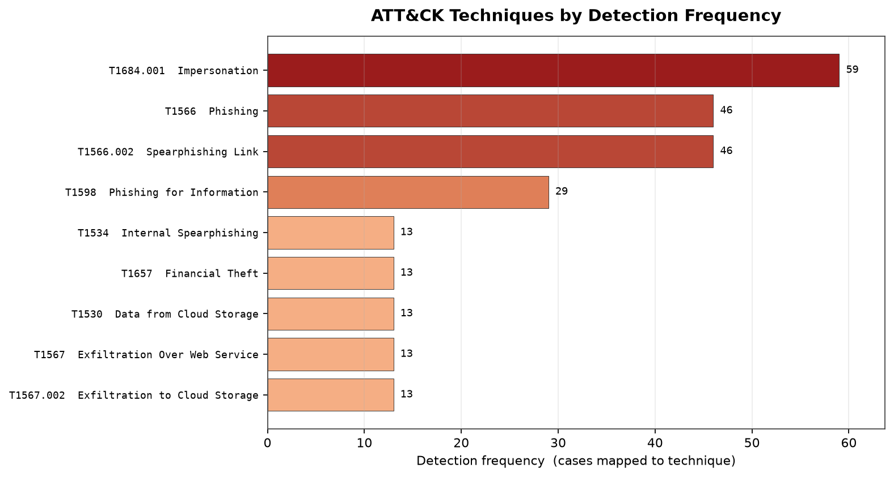
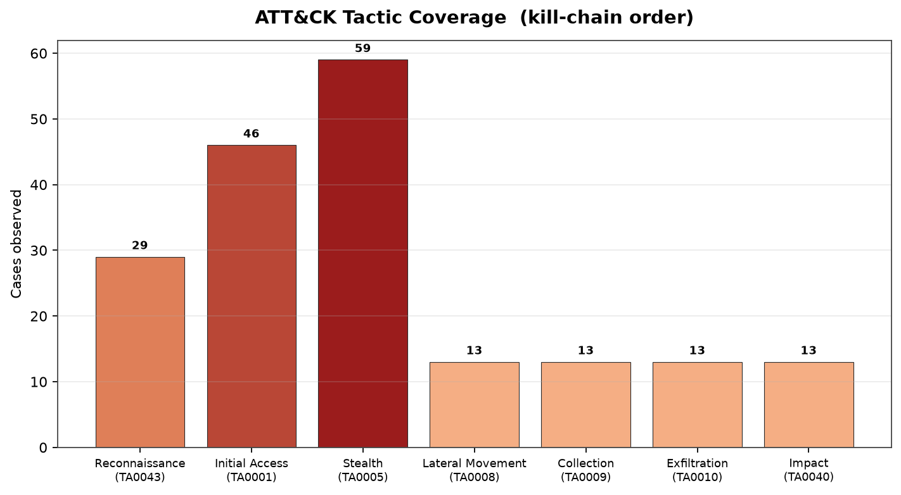
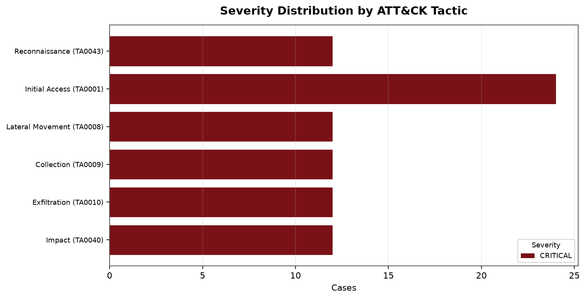
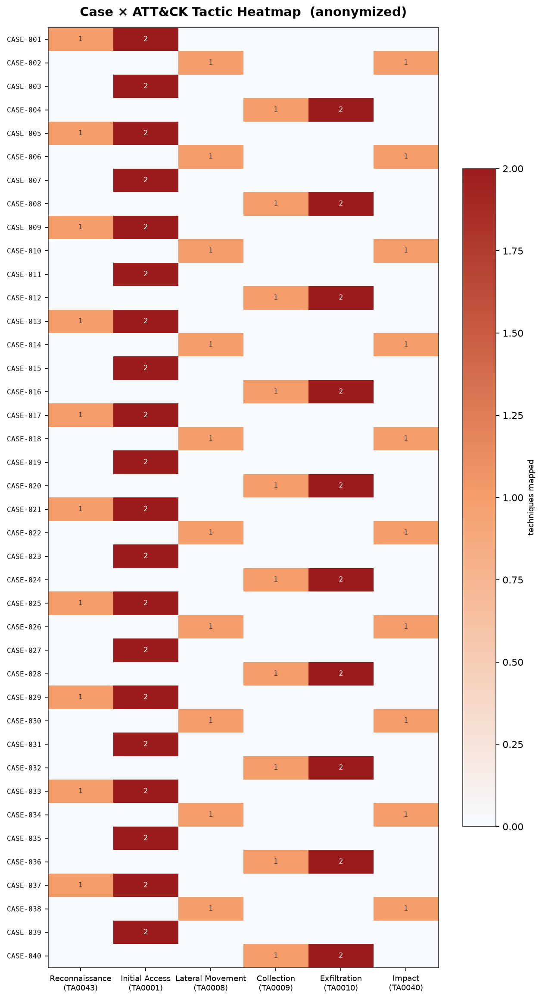
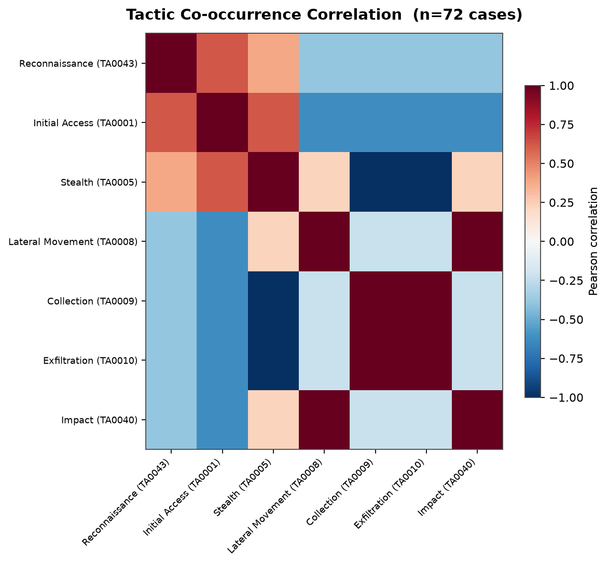
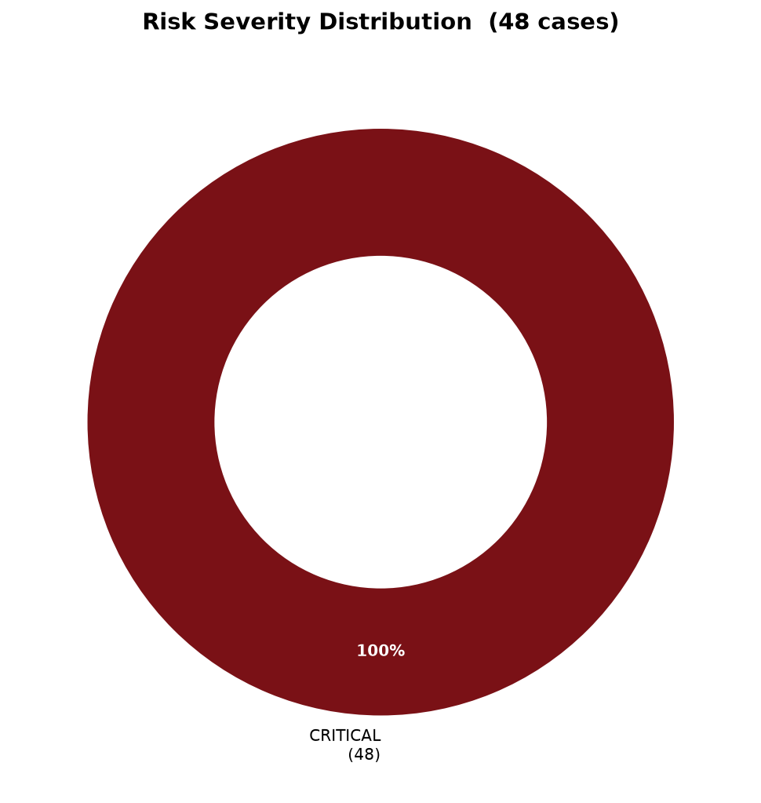

# HunterEngine

**An auditable, glass-box engine that maps suspicious text to MITRE ATT&CK, with an optional Claude-powered advisory layer.**

HunterEngine triages phishing, business-email-compromise, and insider-exfiltration
lures. For each input it computes an auditable risk score, extracts indicators of
compromise, maps MITRE ATT&CK techniques, generates YARA rules, and produces
professional reports and STIX 2.1 intel — with an **optional** advisory AI layer
that never changes a verdict.

---

## Why it's different

- **Deterministic-first.** The score, tags, and ATT&CK mapping come entirely from
  readable rules. Same input → same result, every time. The AI is strictly
  advisory and downstream — turn it off and the numbers are byte-for-byte
  identical.
- **Fail-closed ATT&CK.** Every technique ID is validated against a local copy of
  the real ATT&CK dataset. Unknown or renumbered IDs are logged and skipped, never
  guessed. Names and tactics come from the dataset, not model memory.
- **Standards-aligned output.** MITRE ATT&CK Navigator layers, and STIX 2.1
  bundles that drop into MISP, OpenCTI, ATT&CK Workbench, and SIEMs.
- **Safe to share.** Reports and STIX exports contain **no message content** —
  cases are anonymized; only IoCs (meant to be shared) are included.

---

## What it produces

The reporting tool (`generate_report.py`) turns one or many analysis sessions into
a clean, MITRE-standardized report. Every chart below is real output from a 48-case
aggregate run — **no message content appears anywhere; cases are anonymized.**

### ATT&CK techniques by detection frequency

Which adversary techniques show up most across the corpus, by official ATT&CK ID
and name. The axis is **detection frequency** (number of cases mapping to the
technique) — HunterEngine maps adversary *behaviour*, not CVEs.



### ATT&CK tactic coverage (kill-chain order)

Coverage across the ATT&CK kill chain, tactics shown by display name and TA-ID in
canonical order.



### Severity distribution by tactic

How severity breaks down across tactics. (In this sample every case is CRITICAL;
on a varied corpus this becomes a multi-color stacked breakdown.)



### Case × tactic heatmap (anonymized)

Per-case behaviour at a glance — each row is an **anonymized** case (`CASE-001`…),
each column an ATT&CK tactic. The raw message text never appears; you read the
*shape* of each case's activity. Phishing cases cluster in Reconnaissance / Initial
Access; exfiltration cases cluster in Collection / Exfiltration.



### Tactic co-occurrence correlation

Which tactics tend to appear together across the corpus. This chart is **only
generated at ≥20 cases** — below that a correlation is statistically meaningless,
so the tool skips it rather than drawing noise. (Collection ↔ Exfiltration and
Lateral Movement ↔ Impact show the expected strong positive correlation.)



### Risk severity distribution

A quick severity overview for non-technical readers.



> Alongside these charts the report also writes `EXECUTIVE_SUMMARY.txt`
> (plain-language brief) and `findings_stix_bundle.json` (STIX 2.1, validated
> through the `stix2` library).

---

## Features

| Capability | Description |
|------------|-------------|
| Heuristic scoring | Keyword primitives with tunable scores → severity (INFO→CRITICAL). |
| IoC extraction | URLs, domains, IPs, emails. |
| ATT&CK mapping | Deterministic combo-rules, validated fail-closed against real ATT&CK. |
| YARA generation | One deployable rule per scored item. |
| Optional AI advisory | Analyst notes + action items on HIGH/CRITICAL items (cloud or local). Never alters scoring. |
| AI-assisted YARA | Contextual-phrase rule drafting behind a mandatory compile gate; quarantined for review. |
| Visualization | ATT&CK Navigator layer + self-contained heatmap SVG. |
| Reporting | Standalone tool → the charts above, an executive summary, and STIX 2.1. |
| STIX 2.1 / TAXII | Machine-readable findings bundle for sharing into other platforms. |

---

## Quick start

```bash
cd HunterEngine
python3 -m venv .venv && source .venv/bin/activate
pip install -r requirements.txt

# analyze (deterministic only), general-purpose profile
python3 HunterEngine.py test_input.txt --no-ai -c primitives/merged_primitives.json

# read the verdict
cat HunterEngineBox/session_*/_summary_report.md

# build the report shown above (charts + summary + STIX) across all runs
pip install matplotlib numpy
python3 generate_report.py --all
xdg-open report_aggregate
```

> On Debian/Kali you **must** use a virtual environment (PEP-668). The first run
> downloads the ATT&CK dataset into `mitre_cache.json` once.

---

## Optional AI layer

Off by default. Enable a **cloud** model:

```bash
export HUNTER_AI_PROVIDER=anthropic
export HUNTER_AI_MODEL=claude-sonnet-4-5
export HUNTER_AI_ALLOW_REMOTE=1     # required for any non-local endpoint
export HUNTER_AI_API_KEY=<key>
python3 HunterEngine.py test_input.txt -c primitives/merged_primitives.json
```

…or a **local** model (nothing leaves the box):

```bash
export HUNTER_AI_PROVIDER=openai-compatible
export HUNTER_AI_BASE_URL=http://localhost:11434/v1
export HUNTER_AI_MODEL=llama3.1
```

`--no-ai` forces a pure deterministic run regardless of environment.

> **Data egress:** cloud AI sends item text off-box. Use a local provider or
> deterministic-only for sensitive data. **Never commit API keys**; export them
> and rotate immediately if exposed.

---

## Repository layout

```
HunterEngine.py          # the engine (scoring, IoC, ATT&CK, YARA, AI orchestration)
ai_enrichment.py         # advisory AI layer (advisory-only)
yara_ai.py               # AI-assisted YARA drafting (compile-gated, quarantined)
attack_viz.py            # Navigator layer + heatmap
generate_report.py       # standalone reporting: charts + summary + STIX 2.1
run_pipeline_test.sh     # 4-mode end-to-end test harness
primitives/              # primitive profiles (default phishing, BEC, insider, merged)
mitre_cache.json         # local ATT&CK dataset (built on first run)
requirements.txt
MANUAL.md                # comprehensive operator & developer manual
POCKET_MANUAL.md         # short operator quick reference
docs/images/             # screenshots used in this README
```

---

## Documentation

- **[MANUAL.md](MANUAL.md)** — comprehensive: every flag, feature, env var, the
  data schema, how to write and extend primitives, ATT&CK mapping, the AI layers,
  reporting, STIX export, security, and troubleshooting.
- **[POCKET_MANUAL.md](POCKET_MANUAL.md)** — the commands you type day to day.

---

## Reporting tool at a glance

```bash
python3 generate_report.py --all            # aggregate all sessions
python3 generate_report.py <session_dir>    # one session
python3 generate_report.py --all --defang   # defang IoCs in the STIX bundle
```

Produces the MITRE-labelled charts above (no message text, anonymized cases), an
executive summary for non-technical readers, and `findings_stix_bundle.json`
(STIX 2.1, validated through the `stix2` library when present). The
tactic-correlation chart appears only at ≥20 cases — it is statistically
meaningless below that and is skipped on purpose.

---

## Scope & intent

HunterEngine is a **defensive** triage and threat-intel tool. It classifies and
enriches suspicious text; it does not generate lures or offensive content. Use it
only on data you are authorized to process. The deterministic core is auditable
and runs offline; the AI layer is advisory only and never changes a verdict.

---

## License

See [LICENSE](LICENSE) and [LEGAL_DISCLOSURE.md](LEGAL_DISCLOSURE.md).
